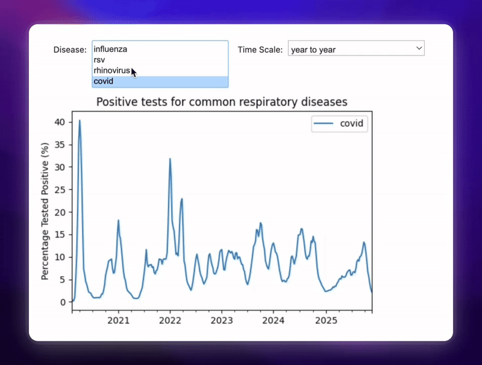
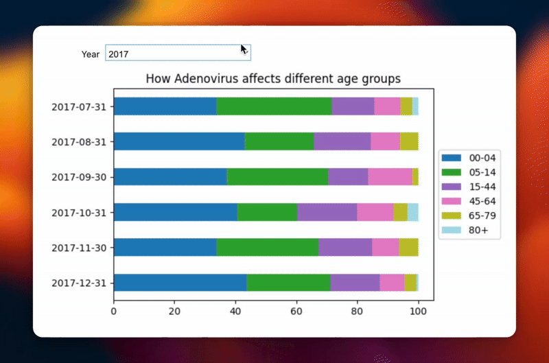

# Respiratory Dashboard

## An interactive dashboard displaying data regarding respiratory diseases in England.

Motivated by the Covid-19 pandemic, this interactive dashboard allows users to gain a better understanding of common respiratory diseases. The dashboard comes pre-loaded with data up to and including 2024. For more recent data, users can click on the 'Refresh API' button.

#### Comparing common respiratory diseases:



#### How Adenovirus affects different age groups:



---

## Tech Stack

-   **Core:** Python 3, Jupyter Notebook
-   **Dashboarding:** [Voila](https://voila.readthedocs.io/) (renders notebook as a web app)
-   **Data Manipulation:** Pandas, JSON
-   **Visualisation:** Matplotlib / Plotly
-   **Interactivity:** ipywidgets
-   **Data Source:** [UKHSA API](https://ukhsa-dashboard.data.gov.uk/)

---

## Getting Started

### Option 1: Run Online (No Setup)

Click the **Binder** badge below to launch the interactive dashboard directly in your browser without installing anything. Note: In order to explore and edit the underlying code, you must run locally.

#### [](https://mybinder.org/v2/gh/vudaodev/respiratory-dashboard/HEAD?urlpath=%2Fvoila%2Frender%2Fdashboard.ipynb)

### Option 2: Run Locally

1.  **Requirements**

-   Python 3.8+
-   Voila
-   Jupyter Notebook

2.  **Clone the repository**

    ```bash
    git clone https://github.com/vudaodev/respiratory-dashboard.git
    cd respiratory-dashboard
    ```

3.  **Create a virtual environment to isolate your dependencies**
    Mac

    ```bash
    python3 -m venv venv
    source venv/bin/activate
    ```

    Windows

    ```bash
    python -m venv venv
    .\venv\Scripts\activate
    ```

4.  **Install dependencies**

    ```bash
    pip install -r requirements.txt
    ```

5.  **Launch the dashboard**
    ```bash
    voila dashboard.ipynb
    ```
    _The dashboard will automatically open in your default web browser._

---

**(C) 2025 - Vu Dao**

Based on UK Government [data](https://ukhsa-dashboard.data.gov.uk/) published by the [UK Health Security Agency](https://www.gov.uk/government/organisations/uk-health-security-agency) and on the [DIY Disease Tracking Dashboard Kit](https://github.com/fsmeraldi/diy-covid19dash) by Fabrizio Smeraldi. Released under the [GNU GPLv3.0 or later](https://www.gnu.org/licenses/).
